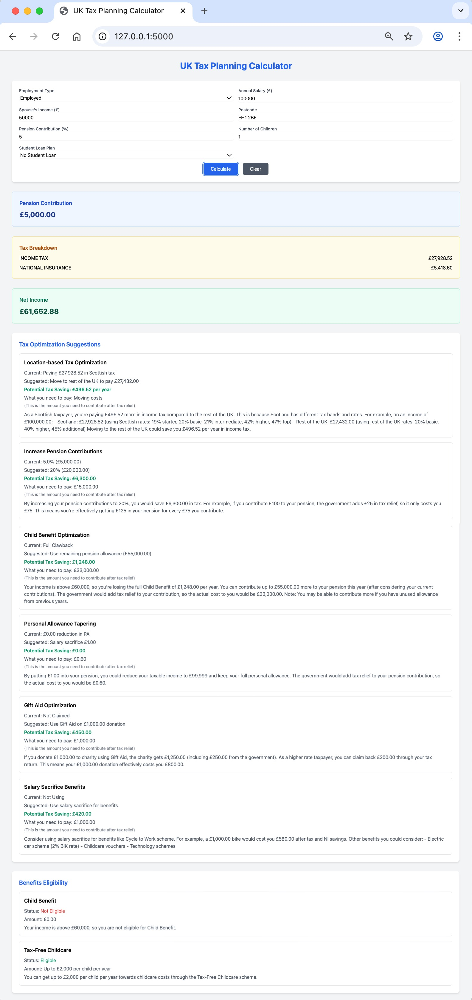

# UK Tax Planning Calculator

A comprehensive web application for calculating UK tax liabilities and providing personalized optimization strategies. The application helps users understand their tax obligations, identifies potential savings opportunities, and checks eligibility for various benefits.

Below is a screenshot of the application in action:



## Table of Contents
- [Features](#features)
- [Project Structure](#project-structure)
- [Prerequisites](#prerequisites)
- [Local Development Setup](#local-development-setup)
- [Configuration](#configuration)
- [Running the Application](#running-the-application)
- [Deployment Options](#deployment-options)
- [Technologies Used](#technologies-used)
- [API Documentation](#api-documentation)
- [Contributing](#contributing)

## Features

- **Tax Calculations**
  - Income tax calculation (including Scottish rates)
  - National Insurance contributions
  - Student loan repayments
  - Pension contribution impact

- **Optimization Strategies**
  - Pension contribution optimization
  - Marriage allowance recommendations
  - Child benefit optimization
  - Personal allowance tapering strategies
  - Gift Aid optimization
  - Salary sacrifice suggestions

- **Benefits Eligibility**
  - Child Benefit eligibility and calculations
  - Marriage Allowance eligibility
  - Tax-Free Childcare eligibility
  - Working Tax Credit assessment
  - Universal Credit eligibility check

- **Report Generation**
  - Detailed PDF reports
  - Comprehensive breakdown of calculations
  - Personalized optimization suggestions
  - Benefits eligibility summary

## Project Structure

```
.
├── backend/                 # Backend Python code
│   ├── app.py              # Flask application
│   ├── tax_agent.py        # Tax calculation logic
│   └── requirements.txt    # Python dependencies
│
├── frontend/               # Frontend code
│   ├── templates/          # HTML templates
│   │   └── index.html     # Main application page
│   └── static/            # Static assets (CSS, JS, images)
│
└── README.md              # Documentation
```

## Prerequisites

- Python 3.8 or higher
- pip (Python package installer)
- Git
- Web browser (Chrome, Firefox, Safari, or Edge)
- Google Gemini API key

## Local Development Setup

1. Clone the repository:
```bash
git clone <repository-url>
cd uk-tax-planner
```

2. Create and activate a virtual environment:
```bash
# On macOS/Linux
python -m venv .venv
source .venv/bin/activate

# On Windows
python -m venv .venv
.venv\Scripts\activate
```

3. Install dependencies:
```bash
cd backend
pip install -r requirements.txt
```

4. Set up environment variables:
Create a `.env` file in the backend directory:
```
GEMINI_API_KEY=your_api_key_here
FLASK_ENV=development
FLASK_APP=app.py
```

## Configuration

### API Keys
1. Get a Google Gemini API key from the [Google AI Studio](https://makersuite.google.com/app/apikey)
2. Add the key to your `.env` file

### Development Settings
- Debug mode is enabled by default in development
- Configure Flask settings in `backend/app.py`
- Adjust tax thresholds in `backend/tax_agent.py`

## Running the Application

1. Start the Flask development server:
```bash
uv run python -m backend.app
```

2. Access the application:
Open your browser and navigate to `http://localhost:5000`

## Deployment Options

### Heroku Deployment

1. Install the Heroku CLI and login:
```bash
heroku login
```

2. Create a new Heroku app:
```bash
heroku create your-app-name
```

3. Set environment variables:
```bash
heroku config:set GEMINI_API_KEY=your_api_key_here
```

4. Deploy the application:
```bash
git push heroku main
```

### AWS Elastic Beanstalk

1. Install the AWS CLI and EB CLI:
```bash
pip install awscli awsebcli
```

2. Configure AWS credentials:
```bash
aws configure
```

3. Initialize EB application:
```bash
eb init -p python-3.8 uk-tax-planner
```

4. Create an environment:
```bash
eb create uk-tax-planner-env
```

5. Set environment variables:
```bash
eb setenv GEMINI_API_KEY=your_api_key_here
```

### Docker Deployment

1. Build the Docker image:
```bash
docker build -t uk-tax-planner .
```

2. Run the container:
```bash
docker run -p 5000:5000 -e GEMINI_API_KEY=your_api_key_here uk-tax-planner
```

## Technologies Used

### Backend
- Python 3.8+
- Flask (Web framework)
- Pydantic (Data validation)
- Google Generative AI (Tax optimization suggestions)
- python-dotenv (Environment management)

### Frontend
- HTML5
- Tailwind CSS (Styling)
- JavaScript (ES6+)
- jsPDF (PDF generation)
- Font Awesome (Icons)

## API Documentation

### Endpoints

#### GET /
- Returns the main application page
- Response: HTML

#### POST /calculate
- Calculates tax and provides optimization suggestions
- Request Body:
  ```json
  {
    "annual_income": float,
    "spouse_income": float,
    "num_children": int,
    "postcode": string,
    "pension_contribution": float,
    "student_loan_plan": string
  }
  ```
- Response:
  ```json
  {
    "success": boolean,
    "calculation": object,
    "optimizations": array,
    "benefits": array
  }
  ```

## Contributing

1. Fork the repository
2. Create a feature branch
3. Commit your changes
4. Push to the branch
5. Create a Pull Request

## License

This project is licensed under the MIT License - see the LICENSE file for details. 